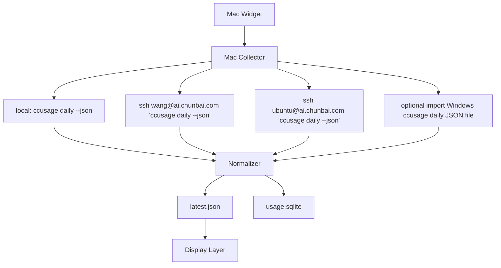

# Architecture

## 核心链路

```text
Mac Widget
        |
        v
Mac Collector
        |
        |-- local: ccusage daily --json
        |
        |-- ssh wang@ai.chunbai.com 'ccusage daily --json'
        |
        |-- ssh ubuntu@ai.chunbai.com 'ccusage daily --json'
        |
        |-- optional import: Windows ccusage daily JSON file
        |
        v
Normalizer
        |
        |-- latest.json
        |-- usage.sqlite
        |
        v
Display Layer
```

MVP 的架构只围绕这条链路展开：Mac 侧 collector 负责本地和远程采集，normalizer 负责把 ccusage daily 输出变成稳定内部 JSON，collector 同时写 `data/latest.json` 和 `data/usage.sqlite`。展示层只读取 `latest.json`。当前 Mac 是汇聚中心，不把远程或 Windows 的 `.claude`、`.codex` 原始日志同步到 Mac。Windows file import 保留为未来可选能力，不进入默认 source。

## 系统分层



## 进程边界

采集发生在各自 OS 用户上下文：

- Mac source：collector 在 Mac 当前用户下本地执行 `ccusage daily --json`。
- Linux `wang` source：collector 通过 SSH 登录 `wang`，远程 shell 执行 `ccusage daily --json`。
- Linux `ubuntu` source：collector 通过 SSH 登录 `ubuntu`，远程 shell 执行 `ccusage daily --json`。
- Windows optional source：如果未来 Windows 本机有值得保留的 AI agent 用量，Windows 用户在本机账户下执行 `ccusage daily --json`，把生成的 ccusage JSON 报表补录到 Mac 汇聚目录，由 Mac collector 读取文件。

禁止路径：

- 禁止 `wang` 读取 `/home/ubuntu`。
- 禁止 Mac collector 直接读取远程 `/home/wang/.claude` 或 `/home/ubuntu/.codex`。
- 禁止把远程 home 目录同步到 Mac 后再解析。
- 禁止把 Windows 的 `%USERPROFILE%\.claude`、`%USERPROFILE%\.codex` 同步到 Mac 后再解析。

## Windows 手动补录方案（可选）

Windows 机器也可以使用 `ccusage`，但当前 Windows 电脑没有值得导出的本地 AI agent 用量，MVP 不把 Windows 作为默认 source。该方案仅作为未来可选补录能力：Windows 侧在本机用户上下文生成 `ccusage daily` JSON 报表，Mac 侧只接收报表文件并统一标准化。

Windows 侧命令：

```powershell
npx ccusage@latest daily --json --timezone Asia/Shanghai `
  | Out-File -Encoding utf8 .\windows-<host>-daily.json
```

规则：

- Windows 上的 Claude Code 数据源是 `%USERPROFILE%\.claude\projects\`。
- Windows 上的 Codex 数据源是 `%USERPROFILE%\.codex\sessions\`。
- 补录文件是 `ccusage daily --json` 的原始报表，不是 `.claude` 或 `.codex` 原始日志。
- 补录文件不提交到 git，建议放在 `data/imports/` 这类本地忽略目录。
- Mac collector 读取补录文件时，仍按统一 `timezone` 解释日期；默认和本机汇报口径对齐到 `Asia/Shanghai`。
- 如果 Windows 后续开启 SSH 或其他远程执行能力，可以新增 `type: "ssh"` 或专用 runner，但不影响当前文件补录方案。

## VS Code 扩展边界

VS Code 扩展本身不作为默认 source 类型。只有当扩展底层写入 `ccusage` 已支持的数据源，或扩展能导出包含时间、session、model、token 分项的结构化报表时，才接入采集。

规则：

- 如果 VS Code 只是启动 Claude Code CLI 或 Codex CLI，且日志落在 `.claude` 或 `.codex`，按对应 CLI source 采集。
- 如果是 GitHub Copilot CLI 并开启了 `ccusage` 支持的本地 OpenTelemetry JSONL，后续可新增 Copilot source。
- 不默认采集 GitHub Copilot VS Code 扩展、Cursor/Continue 等扩展的私有 UI 状态或云端状态。
- 不基于聊天文本长度估算 token。
- 新扩展接入前必须先确认它能被 `ccusage daily --json` 统计到，或者能导出等价的结构化 daily 报表。

## SQLite 存储口径

MVP 使用 SQLite，但它只是本地文件 `data/usage.sqlite`，不是数据库服务。collector 每次生成 `latest.json` 的同时，把同一批 daily 标准化记录 upsert 到 SQLite，方便后续查询历史日期和趋势。

采集原则：

- 每次采集执行 `ccusage daily --json --timezone <timezone>`。
- 所有 source 都显式传入统一时区，例如 `--timezone Asia/Shanghai`。
- 对同一 source、同一日期、同一 agent、同一 model 的 daily 记录执行 upsert，保留 `first_seen_at` 和 `last_seen_at`。
- 当前日允许后续采集覆盖为更新值。
- 不归档 agent 原始日志目录。
- 不在 MVP 中保存 raw archive。

SQLite MVP 保存的数据：

- `daily[]` 的日期、agent、modelsUsed、metadata、token 分项、totalTokens、totalCost。
- `daily[].modelBreakdowns[]` 的 modelName、token 分项、cost。
- `totals` 只作为本次报表校验和展示辅助，不作为历史事实主键。

去重主键建议：

- daily aggregate：`source_id + date + agent`。
- daily model：`source_id + date + agent + model_name`。

后续如果需要审计回放，再增加 raw archive：

```text
data/archive/raw/<source_id>/<report_type>/<collected_at>.json.gz
```

raw archive 后置，不阻塞当前 Widget MVP。

## Python 模块职责

```text
src/ai_usage_widget/config.py
```

- 读取 `config/sources.local.json`。
- 校验 source 必填字段。
- 设置默认 timeout、timezone、输出路径。

```text
src/ai_usage_widget/runners.py
```

- `run_local(source)`：执行本地命令。
- `run_ssh(source)`：执行 SSH 命令。
- `run_file_import(source)`：读取手动补录的 ccusage JSON 报表文件。
- 返回统一 `CommandResult`：`stdout`、`stderr`、`exit_code`、`duration_ms`、`error_type`。

```text
src/ai_usage_widget/normalize.py
```

- 解析 ccusage JSON。
- 提取 daily token 字段。
- 输出统一 `SourceUsage`。
- 如果 ccusage 字段和预期不一致，返回 `invalid_json` 或 `unsupported_shape`。

```text
src/ai_usage_widget/collector.py
```

- 遍历所有 source。
- 调用对应 runner。
- 调用 normalizer。
- 生成扁平 `items`。
- 写入 `data/latest.json`。
- 写入 `data/usage.sqlite`。
- 保证部分失败可输出。

```text
src/ai_usage_widget/storage_json.py
```

- 将 snapshot 原子写入 `data/latest.json`。
- 写入方式：`latest.json.tmp` -> `rename`。

```text
src/ai_usage_widget/storage_sqlite.py
```

- 创建或迁移 `data/usage.sqlite`。
- 写入 `collection_runs`、`source_reports`。
- upsert `usage_daily` 和 `usage_daily_models`。
- 不处理 raw archive、session、blocks。

## Source 配置

```json
{
  "timezone": "Asia/Shanghai",
  "sources": [
    {
      "source_id": "mac-local",
      "type": "local",
      "machine": "mac",
      "host_label": "macbook",
      "os_user": "local",
      "reports": {
        "daily": {
          "command": "ccusage daily --json --timezone Asia/Shanghai"
        }
      },
      "timeout_seconds": 20
    },
    {
      "source_id": "linux-wang",
      "type": "ssh",
      "machine": "linux",
      "host_label": "dev-server",
      "os_user": "wang",
      "ssh_user": "wang",
      "ssh_host": "ai.chunbai.com",
      "ssh_port": 22,
      "reports": {
        "daily": {
          "command": "ccusage daily --json --timezone Asia/Shanghai"
        }
      },
      "timeout_seconds": 30
    },
    {
      "source_id": "windows-manual",
      "type": "file_import",
      "enabled": false,
      "machine": "windows",
      "host_label": "windows-pc",
      "os_user": "windows-user",
      "reports": {
        "daily": {
          "path": "data/imports/windows-pc-daily.json"
        }
      },
      "timeout_seconds": 0
    }
  ]
}
```

## `latest.json` schema

当前已实现 daily usage baseline：`generated_at`、`timezone`、`items`、`source_status`。

quota/reset-aware Widget 的目标扩展字段是 `quota_windows`，详见 `docs/subscription-usage-source.md`。该字段缺失时，Widget 必须降级为 baseline 视图。

```json
{
  "generated_at": "2026-05-22T08:30:00+08:00",
  "timezone": "Asia/Shanghai",
  "items": [
    {
      "machine": "macbook",
      "account": "local",
      "agent": "codex",
      "date": "2026-05-22",
      "input_tokens": 12345,
      "output_tokens": 6789,
      "cache_creation_tokens": 1000,
      "cache_read_tokens": 2000,
      "total_tokens": 22134
    }
  ],
  "source_status": [
    {
      "source_id": "mac-local",
      "status": "ok"
    }
  ],
  "quota_windows": [
    {
      "source_id": "mac-local",
      "agent": "claude-code",
      "window": "5h",
      "used": 1842000,
      "limit": 2500000,
      "used_percentage": 0.7368,
      "resets_at": "2026-05-22T17:00:00+08:00",
      "status": "ok",
      "source_type": "structured_export",
      "confidence": "observed"
    }
  ]
}
```

字段规则：

- `machine` 是展示用机器名，来自 source 配置的 `host_label` 或本机名称。
- `account` 是 OS 用户名，例如 `local`、`wang`、`ubuntu`。
- `agent` 是 AI coding agent 名称，例如 `claude-code`、`codex`。
- `date` 是 ccusage daily 统计日期。
- `total_tokens` 优先使用 ccusage 输出中的总 token 字段。
- 如果没有总字段，则用可用分项求和。
- 如果 ccusage 无法区分 Claude Code 与 Codex，先记录为 `agent: "unknown"`，并在任务中补充真实样例后修正 normalizer。
- UI 展示今日总量时，对 `date` 等于今天的 `items[*].total_tokens` 求和。
- `source_status` 是采集健康状态；单个 source 失败不能导致整个 snapshot 缺失。
- `quota_windows` 是 P1 扩展字段；缺失、过期或估算时必须通过 `status` 和 `confidence` 表达，不能让 Widget 猜测。

## SQLite schema

SQLite 保存 daily 标准化记录。`latest.json` 仍是 Widget 展示入口；Widget 不直接读 SQLite。

```sql
CREATE TABLE collection_runs (
  id INTEGER PRIMARY KEY AUTOINCREMENT,
  collected_at TEXT NOT NULL,
  timezone TEXT NOT NULL,
  collector_version TEXT,
  status TEXT NOT NULL
);

CREATE TABLE source_reports (
  id INTEGER PRIMARY KEY AUTOINCREMENT,
  run_id INTEGER NOT NULL,
  source_id TEXT NOT NULL,
  report_type TEXT NOT NULL,
  command TEXT NOT NULL,
  status TEXT NOT NULL,
  ccusage_version TEXT,
  first_period TEXT,
  last_period TEXT,
  error_type TEXT,
  error_message TEXT,
  FOREIGN KEY(run_id) REFERENCES collection_runs(id)
);

CREATE TABLE usage_daily (
  source_id TEXT NOT NULL,
  date TEXT NOT NULL,
  agent TEXT NOT NULL,
  input_tokens INTEGER NOT NULL DEFAULT 0,
  output_tokens INTEGER NOT NULL DEFAULT 0,
  cache_creation_tokens INTEGER NOT NULL DEFAULT 0,
  cache_read_tokens INTEGER NOT NULL DEFAULT 0,
  total_tokens INTEGER NOT NULL DEFAULT 0,
  total_cost REAL,
  metadata_json TEXT,
  first_seen_at TEXT NOT NULL,
  last_seen_at TEXT NOT NULL,
  PRIMARY KEY(source_id, date, agent)
);

CREATE TABLE usage_daily_models (
  source_id TEXT NOT NULL,
  date TEXT NOT NULL,
  agent TEXT NOT NULL,
  model_name TEXT NOT NULL,
  input_tokens INTEGER NOT NULL DEFAULT 0,
  output_tokens INTEGER NOT NULL DEFAULT 0,
  cache_creation_tokens INTEGER NOT NULL DEFAULT 0,
  cache_read_tokens INTEGER NOT NULL DEFAULT 0,
  total_tokens INTEGER NOT NULL DEFAULT 0,
  cost REAL,
  first_seen_at TEXT NOT NULL,
  last_seen_at TEXT NOT NULL,
  PRIMARY KEY(source_id, date, agent, model_name)
);
```

## 错误模型

标准错误类型：

- `missing_tool`
- `missing_file`
- `ssh_failed`
- `command_failed`
- `invalid_json`
- `unsupported_shape`
- `timeout`

错误记录格式：

```json
{
  "type": "ssh_failed",
  "message": "ssh exited with code 255",
  "stderr_tail": "Permission denied"
}
```

`stderr_tail` 只保留短文本，避免泄露敏感信息。
