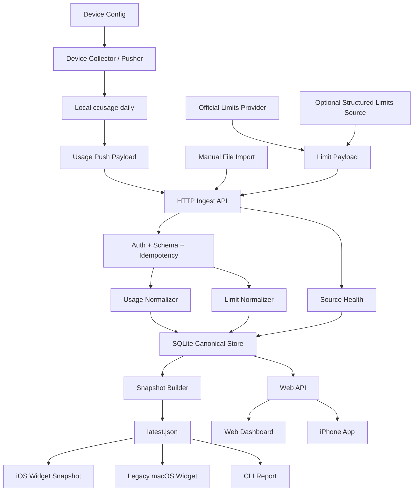

# Architecture

## 架构目标

项目目标从“简单 Widget 读取 `latest.json`”升级为个人 HTTP 汇聚数据管道：

```text
Devices -> Local Collectors -> HTTP Ingest -> Canonical Store -> Snapshot Builder/API -> Presentation
```

Web dashboard、iPhone App 和 iOS Widget 都位于 Presentation 层。它们不拥有终端采集逻辑、不执行 SSH、不推断 quota/reset。既有 macOS Widget 仅作为历史兼容展示面，不再作为后续产品交付目标。

## 总体链路



## 设计边界

### Source Context

每个 source 只能在自己的账户上下文运行：

- Mac source：在 Mac 当前用户下执行 `ccusage daily --json`，再 HTTP push。
- Linux source：在对应 Linux OS 用户下执行 `ccusage daily --json`，再 HTTP push。
- Windows source：在当前 Windows 用户下执行 `ccusage daily --json`，再 HTTP push。
- File import source：只读取明确配置的结构化报表文件。
- Official limits source：只调用官方运行时接口、官方客户端本地 RPC，或读取明确设计的结构化导出文件。
- Historical usage source：可以读取本地 session/log history 做 token/cost 统计，但不能参与 reset time 计算。

禁止：

- 禁止 `wang` 读取 `/home/ubuntu`。
- 禁止汇聚端通过 SSH 登录远端机器抓取 usage。
- 禁止 Mac 直接读取、同步或解析远程 `.claude`、`.codex` 原始日志目录。
- 禁止把远程 home 目录同步到 Mac 后再解析。
- 禁止终端侧上传 `.claude`、`.codex` 原始日志目录。
- 禁止在未授权前修改生产账户配置。
- 禁止从本地 token history、`ccusage daily` 或 `ccusage blocks` 推断官方 quota / reset time。

### Trust Boundary

所有数据必须带来源语义：

- `observed`：由工具输出或结构化导出直接提供。
- `estimated`：由本地窗口、历史或手动规则推算。
- `missing`：当前没有可用来源。
- `unsupported`：来源存在，但 shape 不支持。

UI 只能把 `observed` 展示为强结论；`estimated` 必须弱化；`missing` / `unsupported` 降级。

## 分层职责

### Device Config

职责：

- 读取终端侧本地配置。
- 校验 schema version、source id、host label、OS user label、server URL、timeout、timezone。
- 保存本机 pusher 所需的认证 token 引用，不把 token 提交到仓库。

要求：

- `config/sources.example.json` 只做结构样例。
- `config/sources.local.json` 不提交。
- 测试使用临时配置和 fixtures。

### Device Runner / Pusher

职责：

- 执行本机 `ccusage daily --json --timezone <tz>` 或读取 file import fixture。
- 把采集结果包装成 HTTP ingest payload。
- push 到 server，并记录 HTTP status、duration、timeout、错误类型。

要求：

- 测试不调用真实 HTTP server。
- runner 必须可注入 fake executor 和 fake HTTP client。
- 所有 command 和 HTTP request 有 timeout。
- 定时调度器（如 cron, launchd, task scheduler）调度的运行必须具有超时或单实例锁保护，防止前一次运行挂起导致后台进程不断堆积。

### HTTP Ingest

职责：

- 提供个人 server 的 usage ingest endpoint。
- 校验认证、schema version、source id、timezone、observed_at、payload size 和幂等 key。
- 只接收结构化 usage payload，不接收原始日志目录。
- 对成功、重复、认证失败、schema 错误、stale payload 输出结构化响应。
- 必须显式捕获并保存终端上报的时区（timezone）属性，为后续数据按统一时区汇总和快照生成提供对齐依据。

要求：

- 测试不依赖真实网络端口。
- 认证失败和 malformed payload 必须有 contract tests。
- 重复 push 必须幂等。

### Server Runner

职责：

- 接收 HTTP ingest 已校验 payload 或读取 file import。
- 只返回 `ReportEnvelope`，不解析业务字段。
- 捕获 exit code、stderr、duration、timeout、错误类型。

要求：

- runner 必须可注入 fake executor。
- 所有 command 有 timeout。

### Normalizer

职责：

- 把外部报表转换成内部 usage facts 或 limits facts。
- 对 unsupported shape 给出结构化错误。
- 不写文件、不访问网络、不执行命令。

要求：

- 每种输入 shape 都有 fixture。
- malformed JSON、缺字段、未知 agent 都有测试。

### Official Limits Provider

职责：

- 为 Claude Code、Codex、后续 Antigravity 提供官方额度窗口读取。
- 输出 provider/window 级 `LimitPayload`，包含 used percent、remaining percent、reset time、observed_at、source_type、confidence、status。
- 与 daily usage pipeline 分离；provider 失败不能阻塞 token usage 上报。

推荐优先级：

- Claude Code：OAuth Usage API -> CLI `/usage` PTY -> Web API。
- Codex：OAuth/WHAM usage -> `codex app-server` RPC `account/rateLimits/read`。
- Antigravity：Language Server `GetUserStatus` -> `GetCommandModelConfigs`；当前已完成离线 fixture parser，真实 reader 后续单独接入。

CodexBar 源码核验结论：

- App runtime 的 Codex auto 顺序是 OAuth/WHAM first，CLI RPC second。
- CLI runtime 的 auto 顺序不同：web dashboard first，CLI RPC second。
- 本项目后台采集采用 app runtime 思路，不默认依赖 web dashboard cookies。

禁止：

- 不读取或上传 `.claude`、`.codex` 原始日志目录来推断 reset。
- 不把 local history、`ccusage blocks` 或手动估算标成 `confidence: "observed"`。
- 不在单元测试里调用真实官方 API。

### Canonical Store

职责：

- SQLite 保存事实和采集状态。
- 用 stable primary key 做 upsert。
- 保留 first_seen_at、last_seen_at。
- 必须启用 SQLite 的 WAL (Write-Ahead Logging) 模式，并配置合理的繁忙等待超时（busy timeout，如 5.0 秒），以防止多设备并发 push 或 build 快照时发生锁定冲突。

当前逻辑表：

- `collection_runs`
- `source_reports`
- `usage_daily`
- `usage_daily_models`

目标扩展表：

- `limit_windows`
- `snapshot_builds`

`limit_windows` 只保存设计过的 official/provider facts，不保存 provider 原始 token、cookie、完整 API 响应或本地原始日志。

### Snapshot Builder

职责：

- 从 canonical store 和本轮采集状态构建展示快照。
- 生成今日 summary、source health、token type totals、group totals。
- 只把展示层需要的聚合写入 `latest.json`。
- 在跨设备 daily 聚合计算时，必须将各终端在各自时区下上报的数据，按照统一的目标展示时区（Snapshot Timezone，如 `"timezone": "Asia/Shanghai"`）做对齐，防止数据在自然日跨天边界产生重叠或统计漂移。

要求：

- `latest.json` 必须原子写入。
- snapshot schema 必须 versioned。
- 缺失 limits 时 snapshot 仍合法。

### Presentation

职责：

- Web API 查询 canonical store 或派生快照。
- Web dashboard 展示总量、分组、source health、stale source 和错误摘要。
- iPhone App 通过只读 Web API 或派生快照展示总览、drilldown、source health 和 limits。
- iOS Widget 只读 App 或 server 准备好的轻量摘要，不承载完整 dashboard。
- Swift core 解码 snapshot 的能力可复用到 iOS 客户端。
- 既有 macOS SwiftUI / WidgetKit 只作为历史兼容展示面。

禁止：

- 不执行 collector。
- 不执行 SSH。
- 不执行 `ccusage`。
- iPhone App / iOS Widget / macOS Widget 不读取 SQLite。
- 不从 token history 推断官方 quota。
- reset time 只展示来自 `limits` 中 `confidence: "observed"` 的 provider fact；缺失时降级。

## 目标 `latest.json` v1

当前实现可以继续输出旧字段，但工程化目标是 versioned display snapshot。

```json
{
  "schema_version": 1,
  "generated_at": "2026-05-24T12:30:00+08:00",
  "timezone": "Asia/Shanghai",
  "summary": {
    "date": "2026-05-24",
    "total_tokens": 22134,
    "input_tokens": 12345,
    "output_tokens": 6789,
    "cache_creation_tokens": 1000,
    "cache_read_tokens": 2000
  },
  "groups": {
    "by_machine": [
      {"name": "macbook", "total_tokens": 12000}
    ],
    "by_account": [
      {"name": "local", "total_tokens": 12000}
    ],
    "by_agent": [
      {"name": "codex", "total_tokens": 12000}
    ]
  },
  "items": [
    {
      "source_id": "mac-local",
      "machine": "macbook",
      "account": "local",
      "agent": "codex",
      "date": "2026-05-24",
      "input_tokens": 12345,
      "output_tokens": 6789,
      "cache_creation_tokens": 1000,
      "cache_read_tokens": 2000,
      "total_tokens": 22134
    }
  ],
  "source_status": [
    {
      "source_id": "mac-local",
      "status": "ok",
      "observed_at": "2026-05-24T12:30:00+08:00"
    }
  ],
  "limits": [
    {
      "source_id": "mac-local",
      "agent": "claude-code",
      "window": "5h",
      "used": 1842000,
      "limit": 2500000,
      "used_percentage": 0.7368,
      "resets_at": "2026-05-24T17:00:00+08:00",
      "observed_at": "2026-05-24T12:28:00+08:00",
      "status": "ok",
      "source_type": "structured_export",
      "confidence": "observed"
    }
  ]
}
```

兼容要求：

- `items` 和 `source_status` 在迁移期继续存在。
- `limits` 缺失或为空时，Web dashboard、iPhone App 和 Widget 展示降级为 usage baseline。
- `source_id` 应进入 `items`，方便 UI 关联 source health。
- `summary` 和 `groups` 由 snapshot builder 生成，展示客户端不重复实现复杂聚合。

## SQLite 目标口径

SQLite 是个人 HTTP server 的 canonical store，不直接暴露给外部客户端。

设计原则：

- 表结构迁移必须有测试。
- upsert key 必须稳定。
- 当前日数据允许更新。
- 历史数据更新必须保留 last_seen_at。
- 不保存 `.claude`、`.codex` 原始日志。

目标表职责：

- `collection_runs`：一次采集或构建运行。
- `source_reports`：每个 source 的 report 执行状态。
- `usage_daily`：source/date/agent 级 daily aggregate。
- `usage_daily_models`：source/date/agent/model 级 daily model aggregate。
- `limit_windows`：可选 limits facts，带 confidence 和 source_type。
- `snapshot_builds`：快照生成状态和错误摘要。

## 错误模型

标准错误类型：

- `missing_config`
- `invalid_config`
- `command_failed`
- `timeout`
- `http_auth_failed`
- `http_request_failed`
- `http_schema_invalid`
- `missing_file`
- `invalid_json`
- `unsupported_shape`
- `stale`
- `permission_denied`
- `write_failed`

规则：

- 错误必须结构化写入 source status。
- 错误 message 需要截断。
- 错误信息记录时需进行脱敏处理，防止泄露本地系统环境路径、Token/Key 或代码敏感信息。
- 不把 stderr 或原始报表完整写入 `latest.json`。
- 部分失败时，run status 是 `partial_failed`。

## 测试架构

TDD 是落地硬规则。

测试分层：

- Unit tests：config、normalizer、snapshot builder、formatting。
- Contract tests：HTTP ingest fixture 输入到目标 JSON 输出。
- Integration tests：fake device runner + fake HTTP client + temp SQLite + temp latest path。
- Swift tests：snapshot decode、summary mapping、empty/error state。
- Smoke tests：使用临时目录跑 CLI，不触碰真实配置和生产账户。

测试禁令：

- 不在单元测试里执行真实 SSH。
- 不在单元测试里监听真实公网端口。
- 不读取真实 `.claude`、`.codex`。
- 不依赖本机当天真实 usage。
- 不写生产 `data/latest.json` 或 `data/usage.sqlite`。

## 运行和部署策略

当前阶段：

- 手动运行 server。
- 手动运行终端侧 CLI pusher。
- 手动查看 Web dashboard。

后续阶段：

- launchd / systemd / Windows Task Scheduler 定时触发终端侧 pusher。
- server 以本机或内网个人服务运行。
- iPhone App 通过只读 API 或同步快照查看个人 usage 状态。
- iOS Widget 通过 App Group 或系统推荐机制读取 App 准备好的摘要，不直接访问 server store。
- 菜单栏 app 如后续保留，只能触发本机 pusher 或打开 dashboard，不承载主要产品体验。

不做：

- 不暴露 SSH 给汇聚端抓取 usage。
- 不做团队 SaaS 或多租户权限系统。
- 不把 SQLite 直接暴露成外部服务接口。
- 不继续推进 macOS Widget 的视觉、发布或交互路线。
