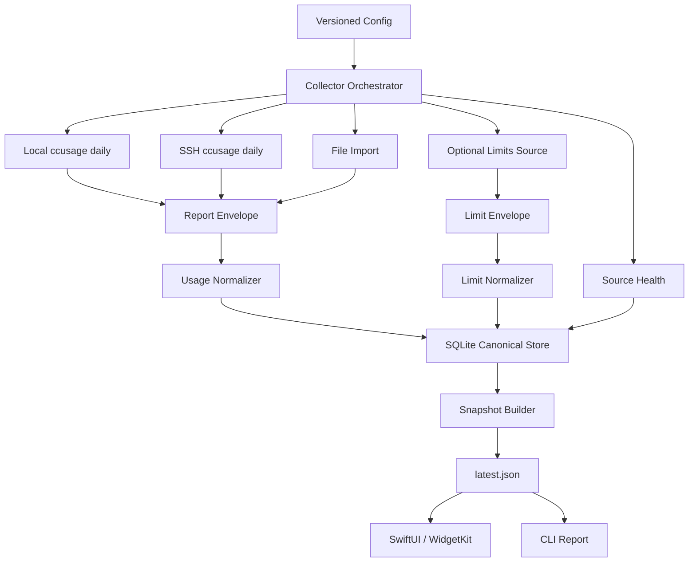

# Architecture

## 架构目标

项目目标从“简单 Widget 读取 `latest.json`”升级为工程化的本机数据管道：

```text
Sources -> Collectors -> Normalizers -> Canonical Store -> Snapshot Builder -> Presentation
```

Widget 只位于 Presentation 层。它不拥有采集逻辑、不直接读取 SQLite、不推断 quota/reset。

## 总体链路



## 设计边界

### Source Context

每个 source 只能在自己的账户上下文运行：

- Mac source：在 Mac 当前用户下执行 `ccusage daily --json`。
- Linux `wang` source：通过 SSH 登录 `wang` 后执行 `ccusage daily --json`。
- Linux `ubuntu` source：通过 SSH 登录 `ubuntu` 后执行 `ccusage daily --json`。
- File import source：只读取明确配置的结构化报表文件。
- Limits source：只读取明确设计的结构化导出文件或后续官方/手动来源。

禁止：

- 禁止 `wang` 读取 `/home/ubuntu`。
- 禁止 Mac 直接读取、同步或解析远程 `.claude`、`.codex` 原始日志目录。
- 禁止把远程 home 目录同步到 Mac 后再解析。
- 禁止在未授权前修改生产账户配置。

### Trust Boundary

所有数据必须带来源语义：

- `observed`：由工具输出或结构化导出直接提供。
- `estimated`：由本地窗口、历史或手动规则推算。
- `missing`：当前没有可用来源。
- `unsupported`：来源存在，但 shape 不支持。

UI 只能把 `observed` 展示为强结论；`estimated` 必须弱化；`missing` / `unsupported` 降级。

## 分层职责

### Config

职责：

- 读取本地配置。
- 校验 schema version、source id、source type、timeout、timezone。
- 拒绝未知必需字段缺失的 source。

要求：

- `config/sources.example.json` 只做结构样例。
- `config/sources.local.json` 不提交。
- 测试使用临时配置和 fixtures。

### Runner

职责：

- 执行 local command、SSH command 或读取 file import。
- 只返回 `ReportEnvelope`，不解析业务字段。
- 捕获 exit code、stderr、duration、timeout、错误类型。

要求：

- 测试不调用真实 SSH。
- runner 必须可注入 fake executor。
- 所有 command 有 timeout。

### Normalizer

职责：

- 把外部报表转换成内部 usage facts 或 limits facts。
- 对 unsupported shape 给出结构化错误。
- 不写文件、不访问网络、不执行命令。

要求：

- 每种输入 shape 都有 fixture。
- malformed JSON、缺字段、未知 agent 都有测试。

### Canonical Store

职责：

- SQLite 保存事实和采集状态。
- 用 stable primary key 做 upsert。
- 保留 first_seen_at、last_seen_at。

当前逻辑表：

- `collection_runs`
- `source_reports`
- `usage_daily`
- `usage_daily_models`

目标扩展表：

- `limit_windows`
- `snapshot_builds`

### Snapshot Builder

职责：

- 从 canonical store 和本轮采集状态构建展示快照。
- 生成今日 summary、source health、token type totals、group totals。
- 只把展示层需要的聚合写入 `latest.json`。

要求：

- `latest.json` 必须原子写入。
- snapshot schema 必须 versioned。
- 缺失 limits 时 snapshot 仍合法。

### Presentation

职责：

- Swift core 解码 snapshot。
- SwiftUI / WidgetKit 根据 snapshot 展示状态。
- WidgetKit sandbox 只读同步后的快照。

禁止：

- 不执行 collector。
- 不执行 SSH。
- 不执行 `ccusage`。
- 不读取 SQLite。
- 不从 token history 推断官方 quota。

## 目标 `latest.json` v1

当前实现可以继续输出旧字段，但工程化目标是 versioned display snapshot。

```json
{
  "schema_version": 1,
  "generated_at": "2026-05-24T12:30:00+08:00",
  "timezone": "Asia/Shanghai",
  "summary": {
    "date": "2026-05-24",
    "total_tokens": 22134,
    "input_tokens": 12345,
    "output_tokens": 6789,
    "cache_creation_tokens": 1000,
    "cache_read_tokens": 2000
  },
  "groups": {
    "by_machine": [
      {"name": "macbook", "total_tokens": 12000}
    ],
    "by_account": [
      {"name": "local", "total_tokens": 12000}
    ],
    "by_agent": [
      {"name": "codex", "total_tokens": 12000}
    ]
  },
  "items": [
    {
      "source_id": "mac-local",
      "machine": "macbook",
      "account": "local",
      "agent": "codex",
      "date": "2026-05-24",
      "input_tokens": 12345,
      "output_tokens": 6789,
      "cache_creation_tokens": 1000,
      "cache_read_tokens": 2000,
      "total_tokens": 22134
    }
  ],
  "source_status": [
    {
      "source_id": "mac-local",
      "status": "ok",
      "observed_at": "2026-05-24T12:30:00+08:00"
    }
  ],
  "limits": [
    {
      "source_id": "mac-local",
      "agent": "claude-code",
      "window": "5h",
      "used": 1842000,
      "limit": 2500000,
      "used_percentage": 0.7368,
      "resets_at": "2026-05-24T17:00:00+08:00",
      "observed_at": "2026-05-24T12:28:00+08:00",
      "status": "ok",
      "source_type": "structured_export",
      "confidence": "observed"
    }
  ]
}
```

兼容要求：

- `items` 和 `source_status` 在迁移期继续存在。
- `limits` 缺失或为空时，Widget 降级为 usage baseline。
- `source_id` 应进入 `items`，方便 UI 关联 source health。
- `summary` 和 `groups` 由 snapshot builder 生成，Widget 不重复实现复杂聚合。

## SQLite 目标口径

SQLite 是 canonical store，不是服务端数据库。

设计原则：

- 表结构迁移必须有测试。
- upsert key 必须稳定。
- 当前日数据允许更新。
- 历史数据更新必须保留 last_seen_at。
- 不保存 `.claude`、`.codex` 原始日志。

目标表职责：

- `collection_runs`：一次采集或构建运行。
- `source_reports`：每个 source 的 report 执行状态。
- `usage_daily`：source/date/agent 级 daily aggregate。
- `usage_daily_models`：source/date/agent/model 级 daily model aggregate。
- `limit_windows`：可选 limits facts，带 confidence 和 source_type。
- `snapshot_builds`：快照生成状态和错误摘要。

## 错误模型

标准错误类型：

- `missing_config`
- `invalid_config`
- `command_failed`
- `timeout`
- `ssh_failed`
- `missing_file`
- `invalid_json`
- `unsupported_shape`
- `stale`
- `permission_denied`
- `write_failed`

规则：

- 错误必须结构化写入 source status。
- 错误 message 需要截断。
- 不把 stderr 或原始报表完整写入 `latest.json`。
- 部分失败时，run status 是 `partial_failed`。

## 测试架构

TDD 是落地硬规则。

测试分层：

- Unit tests：config、normalizer、snapshot builder、formatting。
- Contract tests：fixture 输入到目标 JSON 输出。
- Integration tests：fake runner + temp SQLite + temp latest path。
- Swift tests：snapshot decode、summary mapping、empty/error state。
- Smoke tests：使用临时目录跑 CLI，不触碰真实配置和生产账户。

测试禁令：

- 不在单元测试里执行真实 SSH。
- 不读取真实 `.claude`、`.codex`。
- 不依赖本机当天真实 usage。
- 不写生产 `data/latest.json` 或 `data/usage.sqlite`。

## 运行和部署策略

当前阶段：

- 手动 CLI 采集。
- 手动同步 Widget snapshot。

后续阶段：

- launchd 定时触发 collector。
- App Group container 作为 Widget snapshot 共享目录。
- 菜单栏 app 可以触发采集，但仍通过 collector CLI 或库调用，不把采集逻辑塞进 Widget extension。

不做：

- 不部署远程 daemon。
- 不启动本地 HTTP 服务作为 Widget 数据源。
- 不把 SQLite 暴露成长期运行服务。
