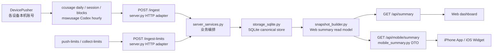

# Architecture Governance

本文记录当前真实架构和后续治理边界。它不是理想重写方案；目标是在不改变用户可见行为的前提下，避免后续功能把入口、口径和 legacy 路线继续混在一起。

## 当前真实架构

当前主流程已经跑通：



用户现在真实看到的是 Web dashboard 和 iPhone App / Widget 的只读结果。它们不执行采集，不执行 SSH，不重新定义 token / limits 口径。

## 依赖方向

推荐依赖方向：

```text
CLI / HTTP handler / iOS App
-> service 编排层
-> ingest / normalize / runtime
-> storage
-> snapshot / read model
-> presentation DTO
```

禁止反向依赖：

- 展示层不得执行 `ccusage`。
- 展示层不得执行 SSH。
- 展示层不得直接调用 provider。
- 展示层不得直接读 SQLite 私有表来重新计算业务口径。
- iOS App 不重新聚合业务指标，只消费 `/api/mobile/summary` 的 mobile summary DTO。
- iOS App 的 server URL trust policy 只接受生产服务或显式自托管 HTTPS 域名；HTTP、localhost、内网 IP、裸 IP 默认拒绝。开发调试可以用显式 override。

## 模块 Owner

| 模块 | Owner 职责 | 禁止承载 |
| --- | --- | --- |
| `cli.py` | 命令解析和调用编排。 | 不直接写展示口径。 |
| `server.py` | HTTP 路由、认证入口、request/response 适配、登录/cookie、静态文件。 | 不承载 ingest 写库、summary 构建、health 聚合等业务编排。 |
| `server_services.py` | HTTP 入口背后的业务编排：ingest、limits ingest、summary/mobile summary、health。 | 不依赖 `BaseHTTPRequestHandler` 或 Web request 对象。 |
| `ingest.py` | Ingest contract、payload 校验、敏感字段边界。 | 不写 SQLite，不构建展示快照。 |
| `pusher.py` | 设备本机采集和 HTTP 上报。 | 不读取其他 OS 用户 home，不做 server-side 聚合。 |
| `storage_sqlite.py` | SQLite schema、写入、upsert、WAL/busy timeout、错误脱敏。 | 不定义 Web/Mobile 展示文案。 |
| `snapshot_builder.py` | `/api/summary` 的唯一 read model owner，负责 period/filter/trend/limits/hourly residual。 | 不把口径分散到 Web、Mobile 或 server route。 |
| `snapshot_periods.py` / `snapshot_filters.py` / `snapshot_trends.py` | `snapshot_builder.py` 的内部 helper：period/date axis、machine/account filter、trend/hourly residual。 | 不成为新的 API owner，不直接被 Web/Mobile 调用。 |
| `mobile_summary.py` | 把 Web summary snapshot 转成 iOS DTO。 | 不重新定义 usage 业务口径。 |
| `limits_*` / provider modules | 官方额度来源、provider runtime、doctor、scheduler、push。 | 不污染 daily usage baseline，不保存 token/cookie/raw response。 |
| `collector.py` / SSH source | Legacy compatibility only。 | V2 新功能不得依赖这条路径。 |

## 数据口径

以下口径以当前代码为准：

- `today`：指定 `date` 当天。
- `week`：以指定 `date` 为结束日，向前 6 天，共 7 天。
- `month`：以指定 `date` 为结束日，向前 29 天，共 30 天。
- `all`：从历史最早数据到指定 `date` 的全量区间。
- `machine/account filter`：`machine` 匹配 source identity 或 usage metadata 中的机器名；`account` 匹配 OS user / account。过滤后的 `/api/summary` 仍复用同一 snapshot shape。
- `limits missing`：limits 缺失或 provider 失败时，usage summary 仍合法；UI 只能降级展示，不能用 daily token 推断官方额度。
- `provider observed`：来自明确 provider / runtime / structured export 的窗口事实，可作为强结论展示。
- `provider missing`：provider 不可用、配置缺失或运行失败，只能作为缺失/失败状态展示。
- `hourly residual`：today 趋势里，当小时级事实不足以覆盖 daily total 时，把差额补到当前可见小时，避免用户看到今日总量和趋势总量明显不一致。Codex 使用 `mswusage_codex_token_count` 时会避免把同一 Codex daily baseline 重复补入小时趋势。
- `mobile summary`：由 `/api/summary` 的 snapshot 派生，只做 DTO 转换和字段裁剪，不重新计算 canonical usage。

## Legacy SSH 策略

- V2 主线只支持 push ingest：`DevicePusher -> /ingest -> SQLite -> summary API`。
- `collector.py` / `ssh` source 是 legacy compatibility。
- 新功能不得依赖 SSH pull。
- 新文档、新 onboarding、新 mobile flow 不得引导用户使用 SSH pull。
- 如果未来删除 legacy，需要单独任务包、迁移说明和回归测试。

## 新功能放置规则

- 新增 API：先写 service 函数，再由 `server.py` 调用。
- 新增展示字段：先进入 `snapshot_builder.py` read model 或 `mobile_summary.py` DTO，不在 dashboard/iOS 里重复聚合。
- 新增 summary 聚合 helper：保持 `snapshot_builder.py` 为 owner，helper 只承接可复用纯函数或局部计算。
- 新增 provider：放 provider module + `limits_runtime.py`，不改 daily usage baseline。
- 新增 App 设置：放 iOS settings / Keychain 层，不写死到视图。
- 新增 App server trust policy：只在 iOS runtime config 和对应 Swift tests 中收敛，不影响后端 API 和 SQLite。
- 新增数据写入：通过 `storage_sqlite.py` 边界，不在 route handler 里直接散写 SQL。

## 禁止事项

- 禁止新增 SSH pull 路线。
- 禁止展示层执行 `ccusage`、SSH 或 provider。
- 禁止从 `ccusage daily` / `ccusage blocks` 推断官方 quota。
- 禁止把 token、auth path、原始日志、`data/latest.json`、`usage.sqlite`、构建产物提交。
- 禁止让一个用户读取另一个用户 home。
- 禁止 Web 和 Mobile 各自定义不同的 usage 口径。

## 测试规则

- 用户主流程必须有行为测试：push 成功、source 失败、`/api/summary`、`/api/mobile/summary`、登录鉴权、App DTO decode。
- 复杂聚合必须有 fixture 测试：today/week/month/all、machine/account filter、limits missing/observed、hourly residual。
- `server.py` 瘦身后，HTTP 测试保留少量 smoke，主要业务规则测试下沉到 service/read model 层。
- 重构必须保持现有 API path、HTTP method、status code 和 JSON 合约不变。

## 提交边界

不得提交：

- `data/`
- `tmp/`
- `*.sqlite`
- `usage.sqlite`
- `latest.json`
- `.build/`
- `xcuserdata/`
- `*.xcuserstate`
- `.env`
- `*.token`
- `auth*`
- `logs/`
- `*.log`
- 原始 usage 日志
- 本地机器专属配置

示例配置可以提交，例如 `config/*.example.json`。本地真实配置不能提交，例如 `config/sources.local.json` 和 `config/limits.local.json`。

## 立即收敛的问题

P1：

- `server.py` 只保留 HTTP 适配，业务编排放入 `server_services.py`。
- `collector.py` / SSH source 明确标记为 legacy。
- `.gitignore` 覆盖本地数据、构建产物、token、日志。

P2：

- `snapshot_builder.py` 内部继续拆 period/filter/trend/limits/hourly residual helper，但仍保留它作为 Web summary read model owner。
- 聚合测试继续从 HTTP 层下沉到 read model/service 层，降低后续改入口时的回归成本。

P3：

- Widget 配置共享必须单独设计 App Group + Keychain access group；不得把 token 放入普通共享 UserDefaults。
