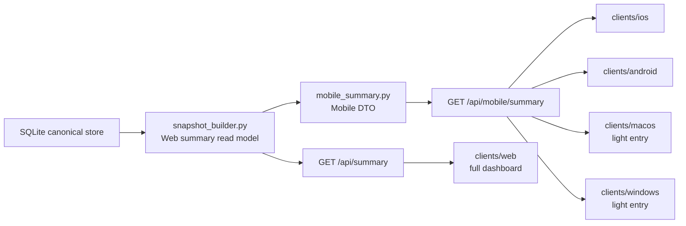

# Client Platform Architecture

本文定义后续 iOS、Android、macOS、Windows、Web 的前端目录和体验边界。目标是让用户在不同设备上看到同一套事实，而不是让每个平台重新计算一套 usage。

## 用户体验分层

| 平台 | 用户看到什么 | 目标目录 | 当前状态 |
| --- | --- | --- | --- |
| Web | 完整 dashboard：机器、OS 用户、agent、趋势、source health、可信 limits。 | `clients/web` | 现有实现仍在 `src/ai_usage_widget/static`。 |
| iPhone / iOS Widget | App 做移动端主体验；Widget 做轻量摘要。 | `clients/ios` | 现有实现仍在 `mobile/ios` 和 `mobile/ios-xcode`。 |
| Android / Android Widget | 复用移动端主体验；Widget 做轻量摘要。 | `clients/android` | 待新建任务包。 |
| macOS | 菜单栏或轻量桌面入口：今日、额度、健康、打开 dashboard。 | `clients/macos` | 待新建任务包；不走 macOS Widget 主线。 |
| Windows | 托盘或轻量桌面入口：健康和关键摘要，完整查看打开 Web。 | `clients/windows` | 待新建任务包。 |

## 目录结构

```text
clients/
  ios/
  android/
  macos/
  windows/
  web/
packages/
  client-contracts/
  design-tokens/
```

迁移期保留现有路径：

- `mobile/ios`：当前 Swift Package。
- `mobile/ios-xcode`：当前 iPhone App / Widget Xcode 工程。
- `src/ai_usage_widget/static`：当前 Web dashboard。
- `widget/macos`、`widget/macos-xcode`：legacy macOS Widget，仅作历史兼容。

不要直接移动这些路径。任何真实迁移都必须单独开任务包，并先保证对应测试或构建命令仍可运行。

## 数据合同



规则：

- Web dashboard 使用 `/api/summary`。
- iOS、Android、Widget、macOS 菜单栏、Windows 托盘优先使用 `/api/mobile/summary`。
- 客户端不直接读取 SQLite。
- 客户端不执行 `ccusage`、SSH 或 provider。
- 客户端不从 daily token 推断官方额度。
- 字段不够时，先扩展 `snapshot_builder.py` 或 `mobile_summary.py`，再改客户端。

## 平台边界

### Web

Web 是完整查看入口。它可以展示最多信息，但仍不拥有业务口径。

### iOS

iPhone App 是移动主体验，iOS Widget 是轻量摘要。现有实现先保留在 `mobile/ios` 和 `mobile/ios-xcode`，后续迁移到 `clients/ios`。

### Android

Android 先复用 iPhone 信息架构。不要为 Android 单独设计一套字段含义；需要新字段时先改 mobile summary DTO。

### macOS

macOS 不再回到 Widget 主线。推荐体验是菜单栏：

- 状态正常 / stale / failed。
- 今日 token 和可信额度窗口。
- 最近更新时间。
- 打开 Web dashboard。

### Windows

Windows 推荐体验是托盘：

- 本机采集健康。
- 全局摘要。
- 打开 Web dashboard。

Windows 展示端和 Windows pusher 分离；pusher 负责采集，client 负责看。

## 共享资产

- `packages/client-contracts/`：保存跨端字段合同、fixture 和验收说明。
- `packages/design-tokens/`：保存状态色、密度、间距、数字格式和跨端视觉语义。

共享资产不能承载业务聚合，不能保存 token、生产配置或原始 usage 日志。
