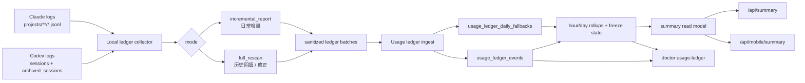

# Usage Ledger Architecture

Date: 2026-06-28
Status: draft for implementation planning
Related PRD: [`../product/usage-ledger-prd.md`](../product/usage-ledger-prd.md)

## 目标

把 Codex / Claude 用量从“本地当前快照反复覆盖”升级为“服务端去重入账账本”。

用户可见结果：

- 归档 Codex session 后，已入账历史日 / 近 7 天 / 近 30 天 / 全部总量不回落。
- 小时图按本地日志记录时间入账，不宣称是真实模型计算时间。
- 当前小时可随增量上报变化；冻结后的小时不被普通增量静默改数。
- 历史修正、确认、忽略由 AI agent 通过无头 CLI 完成，不要求普通用户在 UI 或 Web 里操作。
- 今天作为 live 日期始终纳入当前汇总；今天之前的历史日期才默认执行 confirmed-only 过滤。

## 现状问题

当前主链路仍以 daily snapshot 为中心：

```text
DevicePusher
  -> ccusage daily / blocks + mswusage-codex hourly
  -> POST /ingest
  -> usage_daily / usage_hourly / usage_blocks / usage_hourly_facts
  -> snapshot_builder
  -> /api/summary + /api/mobile/summary
```

这个链路的问题是：

- `usage_daily` 是 `source_id + date + agent` 覆盖写入，不是不可变账本。
- `ccusage codex daily` 默认不读取 `~/.codex/archived_sessions`。
- 用户归档 Codex session 后，旧的 daily snapshot 可能变小，并覆盖较大的历史值。
- 小时图如果依赖 session / block 时间，容易被误读成真实运行小时。

## 目标链路

Usage Ledger 在现有 push 架构内新增一个事件级事实层：



核心变化：

- 客户端上传结构化 usage 明细，不上传 prompt、response、工具输出或原始日志路径。
- 服务端按稳定事件 ID 去重，重复上报不重复计数。
- 日 / 近 7 天 / 近 30 天 / 全部从服务端 ledger 聚合，不再由当前本地快照覆盖。
- doctor / CLI 负责判断待确认、修正、忽略，不增加普通用户 UI 操作。

## 本地采集边界

本地采集仍然只能在当前 OS 用户上下文运行：

- Mac 不直接读取远程 `~/.codex` 或 `~/.claude`。
- 远端机器必须由各自本机 pusher 扫描并主动上报。
- 不允许一个 OS 用户读取另一个 OS 用户的 home。
- 原始日志路径不得进入 payload；只允许上传脱敏 source、机器、OS 用户和账号归因状态。

### Codex

必须同时扫描：

- `~/.codex/sessions`
- `~/.codex/archived_sessions`

入账事实：

- 只读取 `token_count` 事件。
- 入账时间为 `token_count.timestamp`。
- token 数来自 `last_token_usage`。
- `token_count.timestamp` 是记录时间，不是 session 启动 / 停止时间。

### Claude

扫描：

- `~/.claude/projects/**/*.jsonl`

入账事实：

- 只读取 `type=assistant` 且存在 `message.usage` 的记录。
- 入账时间为 assistant 记录的 `timestamp`。
- token 数来自 `message.usage`。
- 重复记录按 `message.id + requestId` 去重；没有 `requestId` 时退化到 `message.id`。

## 两种采集模式

### `full_rescan`

用途：

- 首次历史回填。
- 用户要求重新核查总量。
- 修复异常日期或晚到数据。
- 归档迁移后的人工核查。

规则：

- 不作为日常定时任务。
- 可以全量扫描，也可以按日期范围扫描。
- Codex 必须同时扫 active 与 archived sessions。
- 可以为上线当天生成“切换前今日总量”，但不要求重建切换前每个小时。
- 如果改动已确认日期，必须先进入 `待确认`，通过对账后再回到 `已确认`。

### `incremental_report`

用途：

- 日常每 N 分钟上报。
- 更新当前小时。
- 在保护条件满足后冻结上一个小时。

规则：

- 默认扫描最近窗口，例如最近 2 小时。
- Codex 最近窗口也必须同时扫 active 与 archived sessions。
- 本地候选扫描不能只按 event entry_at 过滤；必须覆盖最近发生变化的日志文件和本地扫描 cursor，避免晚写入但旧 entry_at 的事件永远漏掉。
- 只能追加新事件，不能重新计算历史总量。
- 不能覆盖今天之前的已确认日期。
- 必须上报采集模式、扫描窗口、事件数量和去重结果。

## 服务端职责

服务端负责：

- 校验 payload 不包含敏感路径或原始内容。
- 按事件 ID 去重。
- 以 `source_event_key` 作为去重权威身份，`event_id` 只是其 hash 化主键；parser 版本变化不能导致同一事件新增计数。
- 保存事件级事实。
- 维护小时冻结状态。
- 维护日期可信状态。
- 提供 summary read model。
- 提供 doctor / CLI 所需的机器可读诊断。

服务端不负责：

- 直接读取用户本机 `.codex` / `.claude`。
- 推断无法从本地证据证明的 AI 账号。
- 把 `ccusage daily` 继续作为上线后的主事实源。
- 在普通用户 UI 中暴露修复流程。

## 可信状态

日期状态由服务端维护，doctor 输出：

| 状态 | 含义 | 默认是否进入确定汇总 |
| --- | --- | --- |
| `confirmed` | 明细回填或增量账本对账通过。 | 是 |
| `pending` | 对账差异、晚到事件或待人工确认。 | 否 |
| `fallback_estimated` | 只有日级兜底，没有事件明细。 | 可配置，必须在 doctor 标明 |

日期有效状态按参与来源和 agent 的最差状态计算。任一来源或 agent pending，则该日期和覆盖该日期的近 7 天 / 近 30 天 / 全部汇总都必须标记包含待确认数据。任一来源或 agent fallback，则汇总必须标记包含估算数据。

修正状态用于冻结小时或异常日期：

| 状态 | 含义 |
| --- | --- |
| `repair_pending` | 已发现差异，尚未决定改数。 |
| `repaired` | 已通过回填或人工流程修正。 |
| `ignored` | 已确认差异不进入展示汇总，并记录原因。 |

## 小时冻结

规则：

- 当前小时始终可变。
- 上一个小时在本小时第一次成功上报且扫描窗口覆盖上一个小时尾部后冻结。
- 上报失败不冻结。
- 晚到事件不通过普通增量静默修改已冻结小时。
- 冻结后修正只能走 `full_rescan` / `repair` / `confirm` / `ignore`，并留下审计记录。
- 任一小时进入 `repair_pending`、`repaired` 或 `ignored`，所属日期必须同步标记 pending 或 includes_pending，避免 confirmed 日总静默缺数。

冻结的产品含义是“普通刷新不再改”，不是“永远不能修正”。

## 切换日

上线当天记录 `cutover_at`。

切换日规则：

- 切换后新用量进入 ledger 小时账本。
- 今日总数可以由“切换前今日总量 + 切换后小时账本增量”组成。
- 合并边界必须是半开区间：切换前 `< cutover_at`，切换后 `>= cutover_at`。
- 切换前今日总量保存为 `cutover_pre_total`，只参与今日总数，不生成切换前小时分布。
- 如果后续 full rescan 补齐了切换前 `< cutover_at` 的事件明细，`cutover_pre_total` 必须退出汇总并写 revision，不能与明细相加。
- 今日小时图只承诺切换后准确。
- 切换前小时不要求拆准，也不回写旧小时图。
- doctor 必须能说明当天是否为切换日口径。

## 与现有 summary 的关系

Usage Ledger 不要求客户端重算口径：

- `/api/summary` 仍是 Web read model。
- `/api/mobile/summary` 仍是移动和轻量客户端 DTO。
- Web、iPhone、Watch、macOS 菜单栏不直接读取 ledger 表。
- 近 7 天和近 30 天继续沿用现有呈现口径。
- 今天作为 live 日期纳入汇总；今天之前的 pending / fallback 日期是否纳入，由 doctor 和汇总 metadata 明确说明。

迁移完成后，summary builder 的 usage 来源应从 legacy daily snapshot 逐步切到 ledger rollup。切换前必须保留兼容路径和对账证据。

## 安全边界

不得上传或保存：

- prompt
- response
- tool output
- 原始 JSONL 路径
- auth token
- cookie
- SSH 参数

账号归因规则：

- 本地证据可确认时，保存 provider/account 的脱敏 ID 或受控标签。
- 无法确认时，保存 `unconfirmed_local_source`，展示和 doctor 均输出“本机来源 / 未确认账号”。
- `unknown` 只用于 legacy 导入或上游缺字段导致连本机来源都无法确认的情况；doctor 也按“未确认账号”处理，并提示需要补来源配置。
- 不得从当前登录状态反推历史日志属于同一个 AI 账号。

## 分阶段落地

### Phase 1: 文档和合同

- 冻结 PRD、architecture、database、interface 四份文档。
- 完成 AI review。
- 拆分后续任务包。

### Phase 2: 本地 parser 和离线验收

- Codex parser 覆盖 active + archived。
- Claude parser 实现 message/request 去重。
- 用本机样本和 `ccusage` 日级结果对账。

### Phase 3: 服务端 ledger

- 新增事件表、日状态、冻结和审计。
- 支持批量 ingest、去重和 idempotent retry。
- doctor 能输出待确认、待修正、估算数据和下一步命令。

### Phase 4: Summary 切换

- 先 shadow build ledger summary，与现有 summary 对账。
- 对账通过后切换用户可见 today / week / month / all 来源。
- 保留回退开关，直到连续观察通过。

## 验收

| 验收项 | 通过标准 |
| --- | --- |
| Codex 归档 | active 与 archived 同时扫描；归档前后同一天总量不下降、不重复增加。 |
| Claude 去重 | 同一 `message.id + requestId` 不重复计数。 |
| 模式隔离 | 日常任务只能运行 `incremental_report`，不能误触发总量重算。 |
| 历史回填 | 今天之前完整明细回填，差异日期进入 `pending`。 |
| 小时冻结 | 冻结后普通增量不改数，修正走 CLI 审计。 |
| Summary | 用户端继续只读 `/api/summary` / `/api/mobile/summary`，不重新聚合。 |
| 隐私 | payload、DB、doctor 输出均不含原始日志路径或内容。 |
