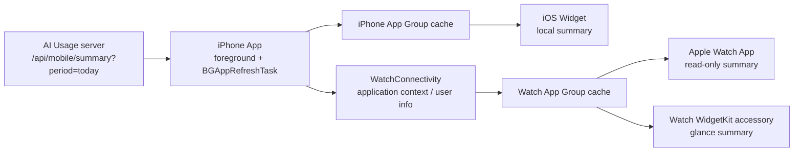

# Architecture: Apple Watch Companion and TestFlight Stable Install

## 目标

把当前 watchOS 只读摘要 App 从“开发安装可跑”推进到“iPhone companion + 表盘组件 + TestFlight 可分发”的稳定体验。

架构目标是复用现有事实链路，不新增采集和服务端口径：



## 当前问题

当前代码已有 `AIUsageWatchApp` target，TP-V2-070 也已经建立 iPhone -> Watch 的 MobileSummary 同步基础，但它仍缺少稳定产品闭环：

- Watch App 没有作为 iPhone App 的稳定 companion 安装路径被验收。
- iOS Widget 只声明了 iPhone widget family，没有独立的 watchOS WidgetKit extension。
- 表盘能力和 Watch App 图标能力没有分开定义。
- 分发仍偏向 Xcode 开发安装，而不是 TestFlight。

## 目标架构

### iPhone App 是 Watch 的数据 owner

iPhone App 继续负责：

- 请求 `/api/mobile/summary`。
- 保存最近一次可用 mobile summary。
- 保护 server token 和配置。
- 复用 TP-V2-070 已有 WatchConnectivity 通道，把符合 companion 条件的 MobileSummary 同步给 Watch。
- 在前台刷新和系统允许的后台刷新后触发 WidgetKit / Watch 刷新。

本轮按 Apple 推荐的 companion 形态处理刷新：iPhone App 是唯一联网 owner，watchOS 侧不变成第二个 server client。iOS 使用 `BGAppRefreshTask` 申请轻量后台刷新，成功拿到 today summary 后写入 iPhone App Group cache，再通过 WatchConnectivity 发送给 Watch。后台刷新不是固定闹钟，系统会根据电量、使用频率和网络状态决定是否执行；用户体验上必须显示最后更新时间和 stale，而不是承诺实时。

Watch 端不保存 token，不直接请求生产 server，不执行采集。本轮不默认新增第二套 iPhone -> Watch 数据合同。

### Watch App 是只读 companion

Watch App 只消费 iPhone 同步来的摘要：

- 显示 Codex quota、reset time、今日用量、更新时间。
- 本地保留最近一次成功摘要，启动时先显示 Watch App Group shared cache。
- 收到新摘要后更新 UI。
- 超过新鲜度窗口后显示 stale。
- 不因为用户没有打开 Watch App 就丢失已有数据。

### Watch WidgetKit accessory 是独立 glance 层

表盘组件不等同于 Watch App 首页。它只展示最少信息：

- `.accessoryRectangular`：额度百分比 + reset time，作为首选承载。
- `.accessoryCircular`：Reset At 双圆环紧凑承载，中心展示 5 小时窗口本地重置时间，外圈固定 5 小时窗口，内圈固定长窗口，并在 stale 时给出可见状态。
- `.accessoryInline`：短文字额度或 stale 状态，作为文本承载。

组件必须由独立 watchOS WidgetKit extension 提供，并嵌入 `AIUsageWatchApp`。Watch App 和 watchOS WidgetKit extension 必须声明同一个 watchOS App Group，用共享容器读写摘要缓存；不能依赖 Watch App 私有 `.cachesDirectory`。它可以 deep link 回 Watch App，但不能要求用户打开 App 才刷新一次。`.accessoryCorner` 可作为后续增强，不阻塞本轮。

表盘组件的刷新由两个信号共同驱动：

- WatchConnectivity 收到新 summary 后写入 Watch App Group cache，并请求 WidgetKit reload。
- WidgetKit 自身根据 timeline policy 重新读取 Watch App Group cache。

表盘组件永远不直接联网。它只负责把 Watch 本地缓存里的最新可信数据展示出来，并在数据过期时给出 stale 状态。

## 数据合同

### 复用字段

本轮复用 `/api/mobile/summary` 已有字段：

- `generated_at`
- `timezone`
- `period.total_tokens`
- `period.input_tokens`
- `period.output_tokens`
- `period.cache_tokens`
- `limits.windows`
- `limits.observed_count`
- `sources`

Watch 展示层只做字段选择和格式化，不重新聚合 usage 或 limits。

### Watch local data contract

本轮 baseline 是复用 TP-V2-070 已有的 MobileSummary 同步，并把 Watch 端摘要缓存升级为 Watch App 和 watchOS WidgetKit extension 共享的 App Group cache。除非实现时证明表盘 extension 不能直接消费现有模型，否则不要新增第二套长期传输合同。

如果确实需要更小的表盘展示 DTO，必须由 iPhone 端从 `MobileSummary` 派生，并替代相应展示面的读取方式，避免和整份 MobileSummary 同步长期并行。候选形状如下：

```json
{
  "schema_version": 1,
  "generated_at": "2026-06-21T12:00:00+08:00",
  "timezone": "Asia/Shanghai",
  "today_total_tokens": 123456,
  "quota_cards": [
    {
      "provider": "codex",
      "window": "5h",
      "used_percent": 42,
      "reset_at": "2026-06-21T15:30:00+08:00",
      "status": "ok"
    }
  ],
  "freshness": {
    "state": "fresh",
    "updated_text": "2 min ago"
  }
}
```

这个 DTO 是 iPhone -> Watch 的本地展示合同，不是新的 server API。只有引入它时才需要新增 Swift decode 测试；未引入时测试应继续证明现有 MobileSummary 同步合同可用。

## 数据库和服务端接口

本轮不改 SQLite schema。

理由：

- Watch 只展示 mobile summary 已经具备的 usage / limits / source health。
- `limit_windows` 已能承载官方额度窗口。
- `usage_daily` / `usage_hourly_facts` 已能承载总用量和趋势事实。
- Watch 不需要独立历史表、设备表或表盘状态表。

本轮不新增 HTTP endpoint。

理由：

- `/api/mobile/summary` 是移动和轻量客户端的既有 DTO owner。
- Watch 所需字段可以由 iPhone App 从该 DTO 裁剪。
- 直接给 Watch 新增 API 会增加 token 下发、网络失败和小屏刷新复杂度。

如果未来要支持完全独立 watchOS App，再另开任务包设计 watch-only auth 和 read model。

本轮移动端只调用现有 `/api/mobile/summary?period=today`。iPhone 前台页面可以继续支持用户切换 period，但后台刷新和 Watch 同步只使用 today，避免 Watch 表盘拿到和用户当前 iPhone 页面筛选状态绑定的数据。

## Xcode / 分发结构

目标结构：

```text
AIUsageMobileApp
  embeds AIUsageMobileWidgetExtension
  embeds / pairs AIUsageWatchApp
  provides shared summary cache and WatchConnectivity bridge

AIUsageWatchApp
  contains Watch summary UI
  embeds AIUsageWatchWidgetExtension
  reads Watch App Group cached summary

AIUsageWatchWidgetExtension
  platform watchOS
  provides WidgetKit accessoryRectangular / accessoryCircular / accessoryInline entries
  shares App Group entitlement with AIUsageWatchApp
  reads Watch App Group cached summary
```

验收重点不是“Xcode 能 build”，而是用户能通过系统路径看到：

- iPhone 上的 TestFlight `AI Usage`。
- iPhone Watch App 中可管理的 `AI Usage` 手表端。
- Apple Watch App 列表中的 `AI Usage`。
- 表盘编辑器中的 `AI Usage` WidgetKit accessory。

## 刷新和过期策略

- iPhone App 每次成功拉取 summary 后写缓存并同步给 Watch。
- iPhone App 注册一个 BGAppRefreshTask，用于系统允许时拉取 today summary。
- 后台刷新每次结束前重新提交下一次 BGAppRefreshTask 请求。
- Watch App 启动时先读 Watch App Group cache，再等待同步。
- iPhone -> Watch 同步成功后，Watch App 写入 Watch App Group cache。
- watchOS WidgetKit accessory 读取同一个 Watch App Group cache。
- `generated_at` 超过 2 小时显示 stale，保持和当前 Watch App 行为一致；如果未来要缩短为 30 分钟，必须作为有意产品变更单独说明。
- 同步失败不清空旧数据，只改变 freshness 状态。
- 如果 iPhone 长期不被系统唤醒，Watch 仍展示最后一次成功同步的数据和 stale，不伪装成实时。
- TestFlight build 到期前 10-20 天发布新 build。

## 安全边界

- Watch 端不保存 Bearer token。
- Watch 端不保存 server URL，除非未来做独立 watchOS App。
- Watch 端不读取 SQLite。
- Watch 端不执行 `ccusage`、SSH、provider runtime。
- Watch 端不显示原始日志路径、账号 token、完整错误堆栈。
- iPhone -> Watch 本地展示合同只包含展示所需摘要。
- Watch App Group 只用于 Watch App 和 watchOS WidgetKit extension 共享展示摘要，不保存 server URL 或 Bearer token。

## 测试和验收

### 自动检查

- 静态测试确认 iPhone App target 与 Watch App target 有稳定关系。
- 静态测试确认 `AIUsageWatchApp` 嵌入 watchOS WidgetKit extension。
- 静态测试确认 `AIUsageWatchApp` 和 watchOS widget extension 声明同一个 App Group entitlement。
- 静态测试确认 watchOS widget extension 声明 `.accessoryRectangular`、`.accessoryCircular`、`.accessoryInline`。
- 静态测试确认 Watch code 不导入 server、collector、provider runtime。
- Swift/Python 静态测试确认表盘组件 source 存在并读取 Watch App Group cache，而不是 Watch App 私有 `.cachesDirectory`。
- 如果新增裁剪 DTO，DTO decode fixture 测试确认 Watch 可读取裁剪摘要；如果不新增 DTO，继续验证现有 MobileSummary decode。

### 手工验收

- 从 TestFlight 安装 iPhone App。
- 在 iPhone Watch App 中确认 `AI Usage` 可安装到 Apple Watch。
- 在 Apple Watch App 列表中打开 `AI Usage`。
- 在表盘编辑器中添加 `AI Usage` WidgetKit accessory。
- 断网或停止刷新后确认 stale 状态可见。

## 后续可选

- App Store 正式发布或 Custom App 分发，消除 TestFlight 90 天有效期。
- 独立 watchOS App，允许无 iPhone 时直接读服务端。
- 多种表盘尺寸的更细化布局。
- Watch 通知提醒，例如额度接近阈值。
