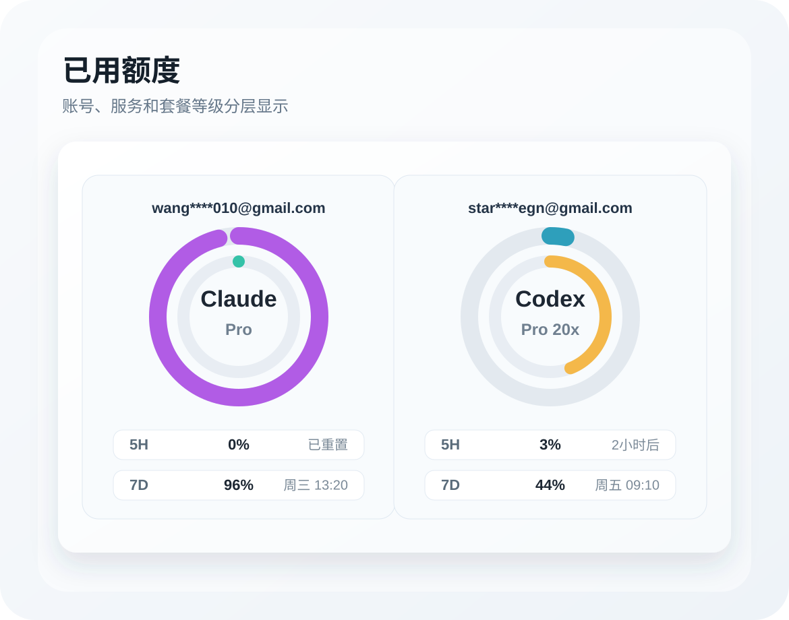

# TP-V2-076 iOS Quota Card Account Label

Version: V2
ID: TP-V2-076
Status: done
Type: implementation
Depends on: TP-V2-043
Parallel with: none

## Goal

Show a safe account label and plan label on each quota ring card in the iPhone App so users can tell which Claude and Codex account each quota belongs to.

## Context

The iOS App currently shows two quota ring cards under `已用额度`: one for Claude and one for Codex. The cards show provider names in the middle of the rings, but they do not show which account the quota belongs to.

Current model boundary:

- `LimitWindow` exposes `source_id`, `provider`, `window`, percentages, reset time, status, and source type.
- `MobileLimitWindow` mirrors those fields in Swift.
- `build_mobile_summary()` passes `limits.windows` through without an account display label.
- The app has source display names elsewhere, but quota windows do not currently carry a user-facing account label.
- Account labels for this task must come from safe AI account fields, such as `account_email`, `account_label`, or the account-hourly AI-account label. Do not use macOS/Linux usernames as a substitute for the Claude/Codex account identity.

Product rule:

- If the backend can safely identify the Claude/Codex account, show it above the relevant ring.
- The account label should prefer the AI account email when available.
- Use the full email when it fits. If it does not fit, truncate in the middle with `*`, preserving the beginning and email domain tail, for example:
  - `wangzhipeng2010@gmail.com` -> `wang****010@gmail.com`
  - `startimessocietegn@gmail.com` -> `star****egn@gmail.com`
- Keep the provider identity inside the ring: `Claude` or `Codex`.
- Add one compact plan line under the provider identity inside the ring.
- If no safe account label is available, do not invent one; fall back to provider-only display.
- Never display tokens, auth file paths, raw credential values, or private config paths.

Research update:

- Claude account identity can be read safely from Claude auth/status surfaces:
  - email: `wangzhipeng2010@gmail.com`
  - display name: `Zhipeng`
  - subscription / organization type observed locally: `pro` / `claude_pro`
  - product display target: `Claude` with plan `Pro`
- Codex account identity can be read safely from Codex auth and CodexBar-compatible account snapshots:
  - email: `startimessocietegn@gmail.com`
  - account ID: `86b44ff3-d85f-4fa7-bbbb-1a662509b3b7`
  - raw plan value observed locally: `pro`
  - product display target: `Codex` with plan `Pro 20x`
- CodexBar open-source behavior maps Codex raw plan names into product-friendly usage multiplier labels:
  - `pro` -> `Pro 20x`
  - `prolite`, `pro_lite`, `pro-lite`, `pro lite` -> `Pro 5x`
  - other values should be title-cased only when they are already safe plan/tier strings.
- CodexBar also surfaces `additional_rate_limits[]` such as `Codex Spark 5-hour` / `Codex Spark Weekly`, but these are extra quota windows, not the account plan label for this task.

Target layout mock:



## Scope

- Add a safe account display label and account plan label to mobile quota data when available.
- Update Swift `MobileLimitWindow` decoding to accept the new optional label.
- Update the quota card UI to place the account label above the ring without crowding the card.
- Update the quota card UI to place the plan label inside the ring, directly under the provider name.
- Keep Claude and Codex provider labels visible.
- Add tests for account label presence, fallback, and redaction.

## Out of Scope

- Do not change how Claude/Codex quota is collected.
- Do not infer official quota from local usage.
- Do not expose raw `~/.claude`, `~/.codex`, token, auth, or config file paths.
- Do not require exact AI account attribution if current runtime evidence cannot provide it.
- Do not change 5h row layout behavior; TP-V2-077 covers that.
- Do not display `Codex Spark` as the account plan. Spark belongs to extra quota windows.
- Do not display `$200/month` unless a stable account-level billing field is added later and verified.

## Red Test

- Add a mobile summary test proving quota windows can include a safe `account_label` or equivalent field.
- Add a mobile summary test proving quota windows can include a safe `account_plan_label` or equivalent field.
- Add a mapping test proving Codex raw `pro` renders as `Pro 20x`, and `prolite` / `pro_lite` / `pro-lite` / `pro lite` render as `Pro 5x`.
- Add a redaction test proving token-like strings, auth paths, and local config paths are not emitted as account labels.
- Add Swift/static coverage proving `MobileLimitWindow` decodes the optional label.
- Add Swift/static coverage proving `ProviderQuotaCard` renders the account label above the ring and plan label inside the ring when present, and does not crash when absent.

## Implementation

1. Identify available safe AI account label sources for quota windows:
   - AI account email if available.
   - AI account display name only if email is unavailable.
   - Account-hourly AI-account label only when it represents the AI account, not a local OS user.
   - Never fall back to macOS/Linux username, host name, raw source path, or local config path.
2. Identify available safe plan label sources:
   - Claude: use `Pro` for observed safe `pro` / `claude_pro` values.
   - Codex: apply the CodexBar-compatible mapping `pro -> Pro 20x`, `prolite` variants -> `Pro 5x`.
   - Unknown or unsafe values should be omitted rather than guessed.
3. Extend mobile summary limit window output with optional `account_label` and `account_plan_label`.
4. Extend Swift decoding with optional fields.
5. Add compact label placement:
   - top of quota mini-card: account label.
   - center of ring: provider name.
   - directly under provider name: account plan label.
   - bottom of mini-card: 5h / weekly rows.
6. Keep truncation deterministic and middle-based for emails.

## Acceptance Criteria

- Claude and Codex quota cards can show a clear account label above the ring.
- Claude and Codex quota cards can show a clear plan label under the provider name inside the ring.
- Codex raw plan `pro` displays as `Pro 20x`.
- Codex raw plan `prolite` variants display as `Pro 5x`.
- Claude observed `pro` / `claude_pro` displays as `Pro`.
- Labels are short enough to fit on iPhone without clipping or making cards uneven.
- If the label is unknown, the UI remains clean and does not show placeholder text like `unknown`.
- No secrets or local auth paths are exposed.
- The quota percentages and reset rows keep their current meaning.

## Verification

```bash
PYTHONPATH=src python3 -m unittest tests.test_mobile_summary tests.test_web_server -v
PYTHONPATH=src python3 -m unittest tests.test_ios_xcode_integration -v
cd mobile/ios && swift test
xcodebuild -project mobile/ios-xcode/AIUsageMobile.xcodeproj -scheme AIUsageMobileApp -configuration Debug -destination '<iPhone simulator or physical iPhone destination>' build
git diff --check
```

Visual check:

- Open the iPhone App.
- Inspect the `已用额度` card.
- Confirm Claude and Codex cards show account labels above the rings when available.
- Confirm provider names remain inside the rings.
- Confirm plan labels appear under provider names inside the rings.
- Confirm cards remain visually balanced and readable on the physical iPhone or simulator.

## Handoff

- Report which label source is used for Claude and Codex.
- Report which plan source and mapping is used for Claude and Codex.
- State when a label is unavailable and what fallback is shown.
- Include screenshot or direct observation of the quota card.
- Confirm no token/auth path/private config value is visible.

## Completion Notes

- Implemented on 2026-06-21.
- Claude displays `wangzhipeng2010@gmail.com` with plan `Pro`.
- Codex displays `startimessocietegn@gmail.com` with plan `Pro 20x`.
- Production `ai_accounts` metadata was seeded with the user-confirmed safe display labels.
- Verified production mobile summary API returns account and plan labels for quota windows.
