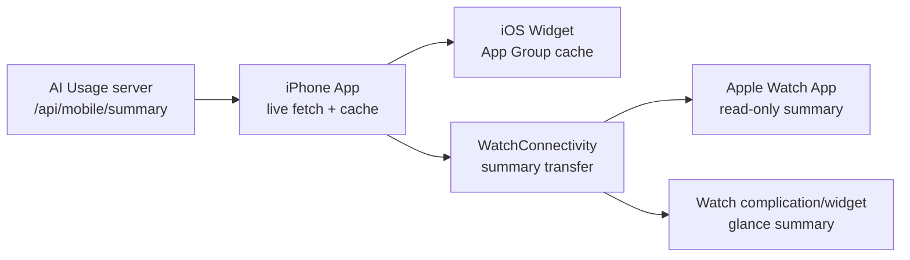

# AI Review Request

## Scope

review_selection:
  selection_mode: user
  risk_score: 6
  selected_target: files:docs/product/watch-companion-testflight-prd.md,docs/architecture/watch-companion-testflight.md,docs/task-packages/v2/TP-V2-083-watch-companion-testflight.md
  selected_mode: local
  input_form: request_artifact
  selected_model_policy: highest
  selected_depth: standard
  selected_rounds: 1
  branch_gate:
    current_branch: codex/watch-companion-testflight
    default_branch: main
    allowed: true
    reason: local read-only review on non-default branch
  actual_reviewer: claude
  actual_model: opus
  model_resolution:
    kind: local-claude-default
    value: opus
  depth_resolution:
    kind: cli_args
    value: ["--effort", "xhigh"]
    confidence: exact
  scope: three new Watch/TestFlight planning docs plus integration references
  rounds_completed: 0
  reasons:
    - user requested Claude Code Ops high bar AI Review
    - multi-document product and implementation planning review benefits from artifact-backed context
    - docs touch TestFlight distribution, Watch install flow, and data-boundary promises

Review these three new docs:

- `docs/product/watch-companion-testflight-prd.md`
- `docs/architecture/watch-companion-testflight.md`
- `docs/task-packages/v2/TP-V2-083-watch-companion-testflight.md`

Also review these integration references only where they link the new docs into the existing doc set:

- `docs/product-brief.md`
- `docs/architecture/architecture.md`
- `docs/task-packages/v2/INDEX.md`

## Repo State

Current branch: `codex/watch-companion-testflight`
Default branch: `origin/main`
HEAD: `929fa0d`

Dirty state:

```text
## codex/watch-companion-testflight...origin/main
 M docs/architecture/architecture.md
 M docs/product-brief.md
 M docs/task-packages/v2/INDEX.md
?? docs/architecture/watch-companion-testflight.md
?? docs/product/
?? docs/task-packages/v2/TP-V2-083-watch-companion-testflight.md
?? reviews/
```

Diff stat before review artifact:

```text
 docs/architecture/architecture.md |  4 +++-
 docs/product-brief.md             | 11 +++++++++++
 docs/task-packages/v2/INDEX.md    |  1 +
 3 files changed, 15 insertions(+), 1 deletion(-)
```

No tests were run before this document review. This is a docs-first review gate before implementation.

## Review Instructions

Treat this as read-only review. Do not modify files.

Use a high bar. Report only findings tied to this scope. Include severity, file/path, evidence, and user impact.

Prioritize issues that could make the owner experience fail:

- TestFlight install flow does not actually produce a manageable Watch companion app.
- The watch face complication/widget promise is underspecified or mismatched with modern watchOS WidgetKit behavior.
- The docs create a false expectation that Apple Watch can show fresh data without the iPhone refresh path being explicit enough.
- The task package is not TDD-actionable for the next implementation agent.
- The docs violate the project boundary: no Watch-side token, no Watch-side collection, no new server endpoint unless separately approved.
- The integration references create task-package index confusion or broken links.

Ignore unrelated historical repo issues. Do not read or output secrets, `.env`, tokens, SSH keys, production config, raw `.claude`, or raw `.codex` logs.

If there are no actionable findings, say no actionable findings and list residual test or manual verification gaps.

## Target Content

### Integration Diff

```diff
diff --git a/docs/architecture/architecture.md b/docs/architecture/architecture.md
index 65618f6..be2b5f2 100644
--- a/docs/architecture/architecture.md
+++ b/docs/architecture/architecture.md
@@ -26,13 +26,15 @@ flowchart LR
     snapshot --> webApi["GET /api/summary"]
     snapshot --> mobileApi["GET /api/mobile/summary<br/>mobile_summary.py DTO"]
     webApi --> dashboard["clients/web<br/>Web dashboard"]
-    mobileApi --> iphone["clients/ios<br/>iPhone App / iOS Widget"]
+    mobileApi --> iphone["clients/ios<br/>iPhone App / iOS Widget / Watch companion"]
     mobileApi --> android["clients/android<br/>Android App / Widget"]
     mobileApi --> desktop["clients/macos + clients/windows<br/>light desktop entries"]
 ```
 
 用户现在真实看到的是 Web dashboard 和 iPhone App / Widget 的只读结果。后续 Android、macOS、Windows 也必须沿用同一套 read model 和 DTO：Web 是完整 dashboard，iOS / Android 是移动查看，macOS / Windows 是轻量入口。它们不执行采集，不执行 SSH，不重新定义 token / limits 口径。
 
+Apple Watch 的稳定安装和表盘组件路线见 [`watch-companion-testflight.md`](watch-companion-testflight.md)。该路线复用 `/api/mobile/summary` 和 iPhone App 缓存，不新增数据库或服务端接口。
+
 ## 依赖方向
 
 推荐依赖方向：
diff --git a/docs/product-brief.md b/docs/product-brief.md
index 15e3bf5..2b9f16a 100644
--- a/docs/product-brief.md
+++ b/docs/product-brief.md
@@ -169,6 +169,17 @@ iOS Widget 是 iPhone App 的轻量 glanceable 展示面，只读 App 或 server
 
 Widget 不承载完整 dashboard，不做复杂 drilldown，不直接调用采集命令或官方 provider。
 
+### Apple Watch
+
+Apple Watch 是 iPhone App 的 companion glance 入口，产品边界见 [`watch-companion-testflight-prd.md`](product/watch-companion-testflight-prd.md)。
+
+目标体验：
+
+- 通过 iPhone App / TestFlight 稳定安装和管理。
+- 在 Watch App 中查看 Codex 额度、reset time、今日用量和数据新鲜度。
+- 在系统表盘 complication/widget 中抬腕查看最小摘要。
+- 只消费 iPhone App 派生的移动摘要，不执行采集、不保存服务端 token。
+
 ### Android App / Widget
 
 Android 复用 iPhone 的移动信息架构：
diff --git a/docs/task-packages/v2/INDEX.md b/docs/task-packages/v2/INDEX.md
index b2d51d9..d3c129b 100644
--- a/docs/task-packages/v2/INDEX.md
+++ b/docs/task-packages/v2/INDEX.md
@@ -119,6 +119,7 @@ Codex hourly usage 方向已完成 TP-V2-060 和 TP-V2-061。TP-V2-060 新增 `M
 | TP-V2-080 | [TP-V2-080-ios-native-liquid-glass-tab-bar.md](../../archive/task-packages/v2/completed/TP-V2-080-ios-native-liquid-glass-tab-bar.md) | done | TP-V2-074 | TP-V2-079 |
 | TP-V2-081 | [TP-V2-081-directory-doc-governance.md](TP-V2-081-directory-doc-governance.md) | in_progress | architecture governance approval | none |
 | TP-V2-082 | [TP-V2-082-test-baseline-backlog-reconcile.md](../../archive/task-packages/v2/completed/TP-V2-082-test-baseline-backlog-reconcile.md) | done | Round 9 approval | none |
+| TP-V2-083 | [TP-V2-083-watch-companion-testflight.md](TP-V2-083-watch-companion-testflight.md) | draft | TP-V2-070, PRD/architecture approval | none |
 
 ## subagent 分配建议
```

### docs/product/watch-companion-testflight-prd.md

```markdown
# PRD: Apple Watch Companion and TestFlight Stable Install

## 背景

当前 Apple Watch 上的 `AI Usage` 体验更像开发安装：项目里已有 `AIUsageWatchApp`，但它没有形成稳定的 iPhone companion 安装体验，也没有可添加到系统表盘的 complication/widget。用户已经在手表上看不到 App，表盘入口也随之消失。

本轮目标不是上架给公众，也不是扩大到团队使用；目标是让单个用户自己的 iPhone 和 Apple Watch 能稳定安装、稳定显示、稳定更新。

## 产品目标

用户从 TestFlight 安装 `AI Usage` 后，应获得这条体验：

1. iPhone 上安装 `AI Usage`。
2. Apple Watch 可以作为 iPhone App 的配套能力被安装和管理。
3. 手表 App 可以查看最新摘要和缓存状态。
4. 系统表盘可以选择 `AI Usage` 的 complication/widget。
5. 90 天 TestFlight build 有效期内，不再依赖 Xcode 临时安装。

## 用户体验范围

### iPhone App

- 仍然是完整移动端查看入口。
- 负责拉取 `/api/mobile/summary`。
- 负责保存最近一次可用摘要。
- 负责把摘要同步给 Apple Watch。
- 负责触发 iOS Widget 和 Watch 相关展示刷新。

### Apple Watch App

- 是 iPhone App 的 companion 体验，不是独立数据产品。
- 显示用户抬腕时最关心的信息：
  - Codex 两类额度使用百分比。
  - 对应 reset time。
  - 今日总用量。
  - 最近更新时间 / stale 状态。
- 无网络或同步失败时，继续显示最近一次成功摘要，并明确标记过期。
- 不做复杂 drilldown，不做趋势图，不做来源长列表。

### 表盘 complication/widget

- 目标是“抬腕一秒判断状态”，不是完整 dashboard。
- 主信息优先级：
  1. Codex 额度百分比。
  2. reset time。
  3. 今日总用量或数据新鲜度。
- 首批支持普通 Apple Watch 可用的系统表盘组件尺寸，不以 Ultra 专属布局作为前置。
- `Modular Duo` 是推荐首屏承载方式；`Modular` 是紧凑 fallback。

### TestFlight

- 用公司稳定 Apple Developer 组织账号上传 build。
- 用户通过 TestFlight 安装 iPhone App，并让 Watch companion 跟随安装。
- 每个 build 最长可用 90 天；在第 70-80 天发新 build，避免突然过期。
- 本阶段不要求公开 App Store 发布。

## 非目标

- 不开发第三方完整自定义表盘；Apple Watch 只支持系统表盘上的 complication/widget。
- 不让 Watch 端直接调用 `ccusage`。
- 不让 Watch 端 SSH、读取 SQLite、读取 `.claude` / `.codex` 原始日志。
- 不在 Watch 端调用官方 limits provider。
- 不新增团队账号、多租户、云同步。
- 不把 TestFlight 当成永久正式分发；它是 90 天滚动 beta 分发。

## 数据和接口判断

本轮不需要新增数据库表，也不需要新增服务端接口。

Watch App 和 complication/widget 使用 iPhone App 已经拿到的 mobile summary 派生数据：

```text
/api/mobile/summary
-> iPhone App cache
-> WatchConnectivity / shared summary
-> Watch App / complication
```

如果后续发现 Watch 需要更小的 DTO，优先在 iPhone 端裁剪，不新增 server endpoint。只有当 `/api/mobile/summary` 缺少可靠字段，才另开服务端接口或 DTO 任务包。

## 成功标准

- 用户从 TestFlight 安装一次后，iPhone App、Watch App、表盘组件都能被系统正常管理。
- Watch 端不再依赖 Xcode 临时安装才能出现。
- 表盘组件可以被添加到系统表盘，并显示 Codex 额度与 reset time。
- Watch 端离线或摘要过期时，用户能看出“这是旧数据”。
- iPhone App、iOS Widget、Watch App、表盘组件看到的 usage / limits 口径一致。
- 90 天过期前可以通过新 TestFlight build 平滑更新。

## 风险

| 风险 | 用户影响 | 处理方式 |
| --- | --- | --- |
| Watch target 没有真正嵌入 iPhone App | 手表 App 仍像临时安装，可能消失 | 调整为 companion 安装结构，并用真机验证。 |
| 只有 Watch App，没有表盘组件 | 用户仍不能在表盘稳定查看 | 新增 complication/widget target 或能力。 |
| TestFlight build 到期 | 90 天后无法继续测试 | 建立 70-80 天发新版节奏。 |
| Watch 显示旧缓存但不提示 | 用户误以为实时数据 | 所有 Watch 面必须显示更新时间或 stale 状态。 |
| Watch 直接拉服务端失败 | 小屏体验不稳定，耗电和网络复杂度上升 | Watch 优先消费 iPhone 同步摘要。 |

## 后续任务建议

1. 调整 Xcode 工程，让 Watch App 成为 iPhone App 的稳定 companion 安装能力。
2. 新增 Apple Watch complication/widget，支持普通表盘尺寸。
3. 补 Watch summary sync/cache/stale 测试和真机验收。
4. 归档 TestFlight 内测发布步骤，包括 build 号、有效期和更新节奏。
```

### docs/architecture/watch-companion-testflight.md

```markdown
# Architecture: Apple Watch Companion and TestFlight Stable Install

## 目标

把当前 watchOS 只读摘要 App 从“开发安装可跑”推进到“iPhone companion + 表盘组件 + TestFlight 可分发”的稳定体验。

架构目标是复用现有事实链路，不新增采集和服务端口径：



## 当前问题

当前代码已有 `AIUsageWatchApp` target，但它仍缺少稳定产品闭环：

- Watch App 没有作为 iPhone App 的稳定 companion 安装路径被验收。
- iOS Widget 只声明了 iPhone widget family，没有 Apple Watch 表盘 complication/widget family。
- 表盘能力和 Watch App 图标能力没有分开定义。
- 分发仍偏向 Xcode 开发安装，而不是 TestFlight。

## 目标架构

### iPhone App 是 Watch 的数据 owner

iPhone App 继续负责：

- 请求 `/api/mobile/summary`。
- 保存最近一次可用 mobile summary。
- 保护 server token 和配置。
- 把安全裁剪后的摘要同步给 Watch。
- 在数据更新后触发 WidgetKit / Watch 刷新。

Watch 端不保存 token，不直接请求生产 server，不执行采集。

### Watch App 是只读 companion

Watch App 只消费 iPhone 同步来的摘要：

- 显示 Codex quota、reset time、今日用量、更新时间。
- 本地保留最近一次成功摘要，启动时先显示缓存。
- 收到新摘要后更新 UI。
- 超过新鲜度窗口后显示 stale。

### complication/widget 是独立 glance 层

表盘组件不等同于 Watch App 首页。它只展示最少信息：

- 小尺寸：一个 quota 百分比或状态。
- 中尺寸：quota + reset time。
- 大尺寸 / Modular Duo：两类 Codex quota + reset time。

组件必须能 deep link 回 Watch App，但不能要求用户打开 App 才刷新一次。

## 数据合同

### 复用字段

本轮复用 `/api/mobile/summary` 已有字段：

- `generated_at`
- `timezone`
- `period.total_tokens`
- `period.input_tokens`
- `period.output_tokens`
- `period.cache_tokens`
- `limits.windows`
- `limits.observed_count`
- `sources`

Watch 展示层只做字段选择和格式化，不重新聚合 usage 或 limits。

### Watch local DTO

iPhone 端可以从 `MobileSummary` 派生一个更小的 Watch DTO：

```json
{
  "schema_version": 1,
  "generated_at": "2026-06-21T12:00:00+08:00",
  "timezone": "Asia/Shanghai",
  "today_total_tokens": 123456,
  "quota_cards": [
    {
      "provider": "codex",
      "window": "5h",
      "used_percent": 42,
      "reset_at": "2026-06-21T15:30:00+08:00",
      "status": "ok"
    }
  ],
  "freshness": {
    "state": "fresh",
    "updated_text": "2 min ago"
  }
}
```

这个 DTO 是 iPhone -> Watch 的本地传输合同，不是新的 server API。需要实现时应有 Swift decode 测试。

## 数据库和服务端接口

本轮不改 SQLite schema。

理由：

- Watch 只展示 mobile summary 已经具备的 usage / limits / source health。
- `limit_windows` 已能承载官方额度窗口。
- `usage_daily` / `usage_hourly_facts` 已能承载总用量和趋势事实。
- Watch 不需要独立历史表、设备表或表盘状态表。

本轮不新增 HTTP endpoint。

理由：

- `/api/mobile/summary` 是移动和轻量客户端的既有 DTO owner。
- Watch 所需字段可以由 iPhone App 从该 DTO 裁剪。
- 直接给 Watch 新增 API 会增加 token 下发、网络失败和小屏刷新复杂度。

如果未来要支持完全独立 watchOS App，再另开任务包设计 watch-only auth 和 read model。

## Xcode / 分发结构

目标结构：

```text
AIUsageMobileApp
  embeds AIUsageMobileWidgetExtension
  embeds / pairs AIUsageWatchApp
  provides shared summary cache and WatchConnectivity bridge

AIUsageWatchApp
  contains Watch summary UI
  contains complication/widget entry
  reads watch-local cached summary
```

验收重点不是“Xcode 能 build”，而是用户能通过系统路径看到：

- iPhone 上的 TestFlight `AI Usage`。
- iPhone Watch App 中可管理的 `AI Usage` 手表端。
- Apple Watch App 列表中的 `AI Usage`。
- 表盘编辑器中的 `AI Usage` complication/widget。

## 刷新和过期策略

- iPhone App 每次成功拉取 summary 后写缓存并同步给 Watch。
- Watch App 启动时先读本地缓存，再等待同步。
- complication/widget 读取 watch-local cache。
- `generated_at` 超过 30 分钟显示 stale。
- 同步失败不清空旧数据，只改变 freshness 状态。
- TestFlight build 到期前 10-20 天发布新 build。

## 安全边界

- Watch 端不保存 Bearer token。
- Watch 端不保存 server URL，除非未来做独立 watchOS App。
- Watch 端不读取 SQLite。
- Watch 端不执行 `ccusage`、SSH、provider runtime。
- Watch 端不显示原始日志路径、账号 token、完整错误堆栈。
- iPhone -> Watch DTO 只包含展示所需摘要。

## 测试和验收

### 自动检查

- 静态测试确认 iPhone App target 与 Watch App target 有稳定关系。
- 静态测试确认 Watch code 不导入 server、collector、provider runtime。
- Swift/Python 静态测试确认 complication/widget source 存在。
- DTO decode fixture 测试确认 Watch 可读取裁剪摘要。

### 手工验收

- 从 TestFlight 安装 iPhone App。
- 在 iPhone Watch App 中确认 `AI Usage` 可安装到 Apple Watch。
- 在 Apple Watch App 列表中打开 `AI Usage`。
- 在表盘编辑器中添加 `AI Usage` complication/widget。
- 断网或停止刷新后确认 stale 状态可见。

## 后续可选

- App Store 正式发布或 Custom App 分发，消除 TestFlight 90 天有效期。
- 独立 watchOS App，允许无 iPhone 时直接读服务端。
- 多种表盘尺寸的更细化布局。
- Watch 通知提醒，例如额度接近阈值。
```

### docs/task-packages/v2/TP-V2-083-watch-companion-testflight.md

```markdown
# TP-V2-083 Watch Companion TestFlight Stability

Version: V2
ID: TP-V2-083
Status: draft
Type: implementation
Depends on: TP-V2-070
Parallel with: none

## Goal

Make the Apple Watch experience stable for the owner by turning the current watchOS summary app into an iPhone companion + watch face complication/widget flow that can be distributed through TestFlight.

## Context

The current watchOS app exists, but the user no longer sees it on Apple Watch. Product direction is now documented in:

- `docs/product/watch-companion-testflight-prd.md`
- `docs/architecture/watch-companion-testflight.md`

This task must preserve the existing data truth chain. Watch must not become a new collection path.

## Scope

- Adjust iOS/watchOS Xcode project structure so the Watch app is managed as part of the iPhone app experience.
- Add an Apple Watch complication/widget surface for supported system watch faces.
- Add a small Watch DTO/cache path derived from existing mobile summary data if needed.
- Add static/fixture tests that prove the target wiring, no-collection boundary, and Watch DTO decode.
- Document TestFlight build/install/update handoff for the owner.

## Out of Scope

- No App Store public launch.
- No custom third-party watch face.
- No new SQLite tables.
- No new server endpoint unless a separate API task package is approved.
- No Watch-side token storage.
- No Watch-side `ccusage`, SSH, provider runtime, raw `.claude` or `.codex` log access.
- No Cloudflare migration work.

## Red Test

- Add a failing test proving the iPhone app target owns or embeds the Watch companion relationship expected by the chosen Xcode structure.
- Add a failing test proving a Watch complication/widget source exists and declares watch-supported families.
- Add or extend a failing no-collection-boundary test proving Watch code does not import server, collector, pusher, storage, or provider runtime modules.
- If a Watch DTO is introduced, add a failing decode fixture test before implementation.

## Implementation

1. Confirm the Apple-supported Xcode structure for companion Watch app + WidgetKit complication in the current Xcode version.
2. Update `mobile/ios-xcode/project.yml` first, then regenerate/check `AIUsageMobile.xcodeproj`.
3. Wire iPhone summary cache to Watch via a small display DTO or existing compatible cache.
4. Add Watch complication/widget entry points that prioritize Codex quota percentage and reset time.
5. Keep Watch App fallback UI for stale/no summary states.
6. Add TestFlight owner handoff notes with 90-day build expiry and renewal timing.

## Acceptance Criteria

- iPhone App, Watch App, and Watch complication/widget are part of one coherent installable product shape.
- Apple Watch App can display cached summary without Xcode-only assumptions.
- Watch face editor can expose an `AI Usage` complication/widget on supported faces.
- Watch surfaces show stale state when data is old.
- Existing `/api/mobile/summary` remains the server data source; no DB or API migration is included.
- Cloudflare worktree and files remain untouched.

## Verification

```bash
PYTHONPATH=src python3 -m unittest tests.test_ios_xcode_integration -v
git diff --check
```

Manual verification, when signing and TestFlight credentials are available:

```text
1. Archive and upload the iPhone app build to TestFlight.
2. Install from TestFlight on the owner's iPhone.
3. Confirm Apple Watch install through the iPhone Watch app.
4. Confirm AI Usage appears in the Apple Watch app list.
5. Add AI Usage complication/widget to a supported system watch face.
6. Confirm stale state after summary freshness window is exceeded.
```

## Handoff

- Report changed Xcode targets and source files.
- Report automated test output.
- Report whether TestFlight upload/install was completed or what credential/device action is still needed.
- Report Apple Watch app list and watch face complication/widget status.
```

## Out Of Scope

- Full repo architecture review.
- Existing code implementation review.
- Production deploy, Cloudflare migration, or server endpoint changes.
- Secrets, credentials, `.env`, raw usage logs, raw `.claude`, raw `.codex`, SSH keys, or production account files.
